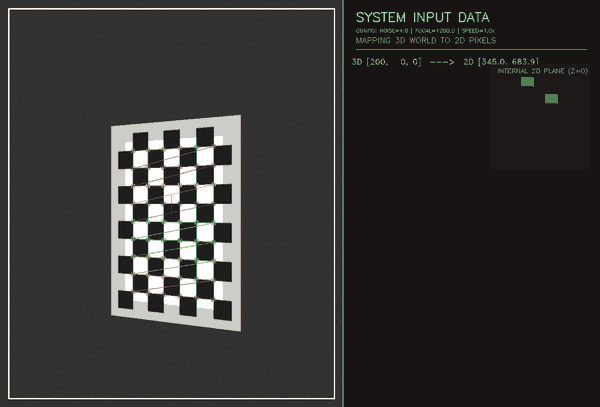
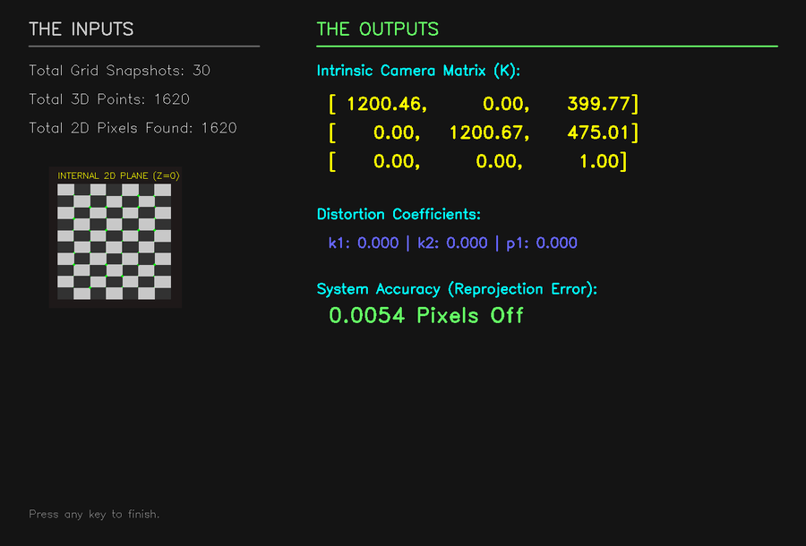

# Synthetic Vision Calibrator

A real-time simulator that shows how camera calibration actually works: it moves a
virtual checkerboard through 3D space in front of a simulated camera, detects the
checkerboard corners with OpenCV the same way you would on a real camera, and then
recovers the camera's intrinsic matrix from those detections — so you can watch the
whole "3D world → 2D pixels → back to a camera model" loop happen live instead of
reading about it.

<p align="center">
  
</p>

## What it's demonstrating

Camera calibration answers a specific question: given a bunch of pixel coordinates and
the real-world 3D points they came from, what focal length, optical center and lens
distortion would produce exactly that mapping? OpenCV's `cv2.calibrateCamera` answers
it with real photos of a checkerboard from different angles. This project generates
those "photos" synthetically instead, using `cv2.projectPoints` to warp a flat
checkerboard through realistic pitch/yaw/roll/zoom camera motion — which means the
ground-truth camera matrix is known in advance, and you can see exactly how close the
recovered matrix gets to it.

1. A checkerboard is projected into 3D space and warped frame-by-frame as if a handheld
   camera were moving around it, with Gaussian sensor noise added.
2. `cv2.findChessboardCorners` + `cv2.cornerSubPix` detect the corners in each frame,
   exactly as they would on a real camera capture.
3. Every 20th successful detection is kept as a calibration sample.
4. Once enough samples are collected, `cv2.calibrateCamera` runs on them, and the
   dashboard shows the recovered intrinsic matrix, distortion coefficients, and mean
   reprojection error against the known ground truth.

## Run it

```bash
pip install opencv-python numpy
python animation.py
```

Needs a display — it opens an OpenCV window, so it won't run over SSH without X
forwarding or in a headless CI job.

| Flag | Default | What it does |
|---|---|---|
| `--noise` | `4.0` | Standard deviation of the Gaussian sensor noise. Push it up to see corner detection get less reliable and reprojection error climb. |
| `--focal` | `1200.0` | Simulated focal length (`fx`, `fy`) fed into the projection — and the value the calibration should recover. |
| `--speed` | `1.0` | Speed of the simulated camera's pan/tilt/zoom. |

```bash
python animation.py --noise 15.0            # stress test: watch reprojection error rise
python animation.py --focal 2400.0 --speed 0.5   # slower, longer lens
```

**Controls:** `Esc`/`Q` to quit at any point, `E` to move from data collection to the
matrix-extraction dashboard once enough checkerboard samples have been gathered.

## Example result

<p align="center"></p>

At the default settings (`--focal 1200.0 --noise 4.0`), one run recovered a focal length
within about 0.5 pixels of the ground truth and a mean reprojection error under 0.01
pixels — noise this low is a favorable case; raising `--noise` is the fastest way to see
error grow.

## How it's built

`ThreadPoolExecutor` pre-renders and detects all 600 frames across every available CPU
core before playback starts, so the animation itself plays back smoothly regardless of
how long detection took. This is single-file (`animation.py`) and depends only on
OpenCV and NumPy.
